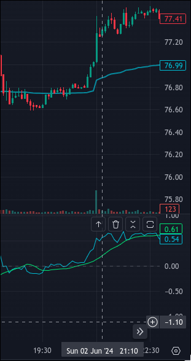
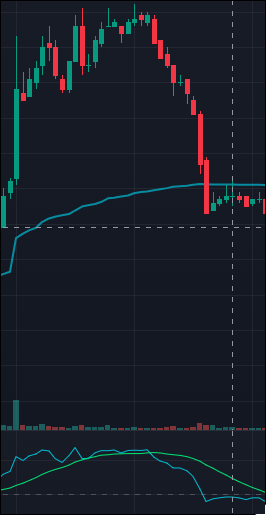

# VWAP Percent Distance

## Installation

### Prerequisites
The intended use of this script is as an indicator in TradingView. TradingView accounts are free to create and can be created at https://www.tradingview.com/. TradingView does contain many paid features, but this indicator can be used without them.

### Downloading the indicator
To download the latest version of the indicator, head over to the releases/tags bar on the Github repository and select the latest version. From there, download the vwap-percent-d.pine file under the Assets tab.

### Installing the indicator
To use the indicator, open the Pine Editor tab in TradingView and click Open, then New indicator. Replace all of the code in the template file that opens with all of the code found in the vwap-percent-d.pine file in the /src/ folder in this repository. Then, click the save button and when prompted to enter a name enter "VWAP %D" or any other name of your choosing. Next, click on the Indicators tab, go to the personal tab and select the indicator with the name you just created. It should now be added to your chart. You may click on the settings icon next to its name on the chart to adjust the key values and styles of the displayed indicator.

## Purpose
Why does this indicator exist? Throughout my trading journey I consistently found myself using the VWAP as an indicator on my charts due to price action consistently reverting towards it after diverging for long enough or bouncing off of it as a key resistance or support level. Whether this behavior occurs because of a natural tendency to revert to a mean value or enough people believe that the VWAP indicator works and trade in a way that makes its values become significant, the behavior occurs regardless. Another thing I began to notice was that price action was more likely to rubber band back towards VWAP the farther away from it got.

This indicator arose out of a need for me to be able to quantifiably measure the distance of price from VWAP to determine how likely price was mean-revert at that moment, the key idea behind this indicator is that instead of just reporting the exact difference between price and VWAP, the indicator reports this value as a percentage to give a more generalized value across different assets. Hence comes the name, VWAP Percent Distance, because it measures the distance from VWAP as a percentage. It is calculated as ((Price - VWAP) / (VWAP)) * 100%

## Usage

### Indicator Composition
This indicator is not meant to give buy and sell signals on its own, but rather be used in conjuction with other indicators to give more accurate readings on when a trader should enter or exit a trade. The indicator has 2 lines, the first is the current price's distance from the VWAP line as a percentage of the current VWAP value and the second line is a moving average of the past (default is 14) VWAP %D values for each candle. The moving average length can be configured in the setttings icon next to the name of the indicator.

There are 3 pre-drawn lines on the indicator, one at 0%, and one at plus and minus one, relative minimum and maximum extremes. What a trader wants to set these relative extreme values to is ultimately up to them depending on the asset. My personal favorage is WTI Crude Oil Futures, so I have mine set at +-1%. 

### How to effectively use this in a trading strategy
Although the indicator giving an exact value of how far price is from VWAP, the real potent part of this indicator is looking at crossovers between the VWAP %D and its moving average. This can be used as an early entry point when other indicators will give a buy or sell signal if a trend continues.

### Examples (Real Trades)
On 6/2/24 WTI Crude Oil July 2024 contracts were trading at around 10:30pm at $77.50 per barrel with a VWAP value of around $77.00. The price action and reported VWAP %D values and coresponding moving averages can be seen in the screenshot below.

As seen above, the VWAP %D crosses over its moving average on that first giant red candle, indicating the start of a possible down trend. Other proprietary indicators I've developed were indicating the start of a sell signal, but wouldn't fully confirm it until 1-2 more red candles after the one seen on screen. After seeing the crossover, I opened up a short position with a take profit a couple ticks above the VWAP value and a stop loss 8 ticks above the entry point (the ATR value at that time) for a solid 1:3 risk to reward ratio. What happened after is shown in the screenshot below.

The price action after entry was an immidiate downtrend with almsot zero drawdown or retracements. Shorted entry signals went off 2 candles late. If I had entered there, as opposed to when the VWAP %D crossover happened, I would have missed out on 15 ticks worth of profit.  